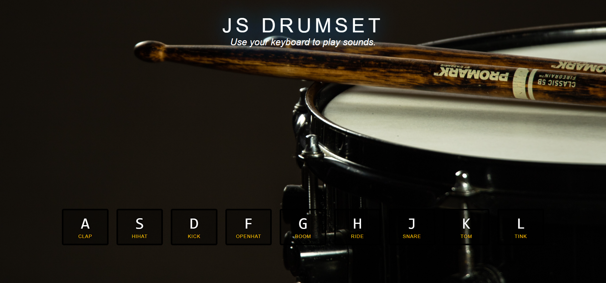

> This is a JavaScript practice with [JavaScript30](https://javascript30.com/) by [Wes Bos](https://github.com/wesbos) without any frameworks, no compilers, no boilerplate, and no libraries.

# 01 - Drum Kit

key event listener, audio play and toggle class.



view demo [here](https://shamgurav96.github.io/JS30/01-JS-Drumset/index.html)

### How to bind an event when key is pressed

`window.addEventListener('keydown', playSound`

-    `playSound()` function will be called whenever the `keydown` event will be triggered in the DOM.

### `data-key` has its own value on `<div>`s and `<audio>`s in HTML

-    Each key has it's own unique keycode value , based on that we can distinguish between multiple keys.
-    You will find more info about keycode on [keycode-info](https://keycode.info/)

### Changing Styles after Key has been transformed

-    use `item.classList.add('className')` to add class to DOM element .
-    use `item.classList.remove('className')` to remove the class from DOM element.

-    By adding listner to `transitionend` event , we can remove the `playing` class of all keys.

```
function removeTransition(e) {
    console.log(e.target.classList);
    e.target.classList.remove('playing');
}
```

---

## License and Copyright

© Sham Gurav , Front End Web developer
