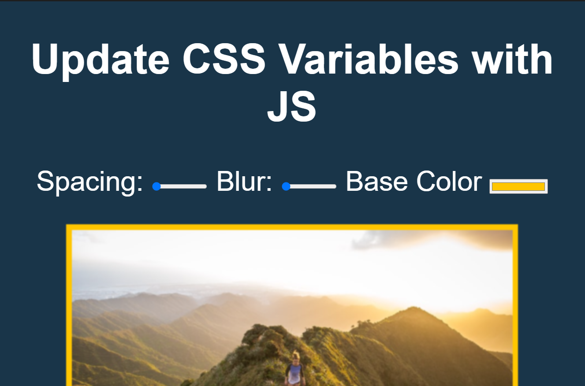

> This is a JavaScript practice with [JavaScript30](https://javascript30.com/) by [Wes Bos](https://github.com/wesbos) without any frameworks, no compilers, no boilerplate, and no libraries.

# 03 - CSS Variables and JS



view demo [here](https://shamgurav96.github.io/JS30/03-JS-CssVariable/index.html)

### This projects demonstrate how to dynamically update the css variables through JavaScript from User Inputs.

-    Declare variables in CSS using `--` same as `$` in SASS.

-    Declare any variable in `:root` selector which matches the document's root element then that variable gets the global scope. Global scope variables can be used in any selector or class.

-    The `var()` CSS function can be used to insert the value of a custom property (sometimes called a "CSS variable") instead of any part of a value of another property. Refer [var()](<https://developer.mozilla.org/en-US/docs/Web/CSS/var()>) here.

```
:root {
  --blur: 10px;
}

img {
  padding: var(--blur);
}

```

### Changing CSS property via JS

`document.documentElement` is the root element in JS, so we can change the global CSS variables by JS is just `setProperty` to `style` like so:

```
document.documentElement.style.setProperty('--base', '#000');
```
