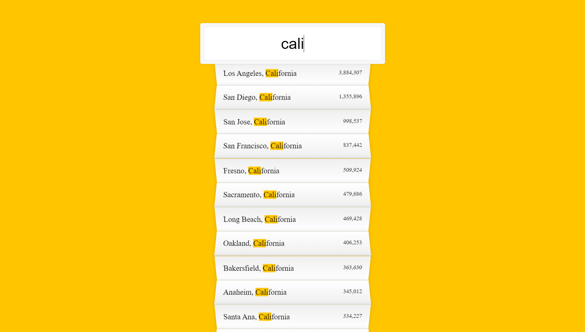

> This is a JavaScript practice with [JavaScript30](https://javascript30.com/) by [Wes Bos](https://github.com/wesbos) without any frameworks, no compilers, no boilerplate, and no libraries.

# 06 - AJAX Type Ahead

view demo [here](https://shamgurav96.github.io/JS30/06-JS-AJAX-Type-Ahead/index.html)
